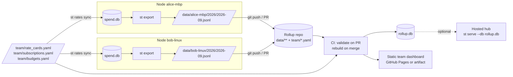

# Multi-user aggregation: rolling local nodes up to a repository

## 1. Flow (D-ROLLUP)



## 2. Export format

`st export --period 2026-09 [--redaction standard]` writes:

```
exports/
  data/<node_handle>/<YYYY>/<YYYY-MM>.jsonl        # one JSON object per line
  data/<node_handle>/<YYYY>/<YYYY-MM>.manifest.json
```

Line schema (`export_schema_version: 1`), one line per `usage_event`:

```json
{"v":1,"event_id":"01J8Z...","node":"alice-mbp","user":"alice","app":"claude_code",
 "account":"acct:anthropic:org_ab12","project":"github.com/acme/api","session":"sess:01J8Y...",
 "occurred_at":"2026-09-02T14:03:11Z","measure":"token.input","quantity":1834,
 "model":"claude-opus-5","sku":null,"tool_name":null,"mcp_server":null,"actor":"alice",
 "source":"otlp","source_ref":"req_01ABC","adapter":"claude_code","attrs":{"effort":"xhigh"}}
```

Sessions, projects and accounts are denormalized into stable string keys so a batch is
self-describing. A separate `dimensions.jsonl` per batch carries the `session` and `project` rows
(started/ended, labels) so the rollup can rebuild them.

Manifest:

```json
{"v":1,"node":"alice-mbp","period":"2026-09","event_count":48211,
 "first_event_id":"01J8...","last_event_id":"01J9...","sha256":"...",
 "redaction":"standard","exported_at":"2026-10-01T06:00:00Z","schema_version":1}
```

Rules:
- Append-only within a period: re-exporting a period rewrites the whole file, and the manifest's
  `last_event_id` must be ≥ the previous one (CI rejects regressions).
- Only `usage_event` and its dimensions are exported. Cost lines are **not** exported; the rollup
  re-prices with the team's rate cards and subscriptions so everyone is priced consistently.
- Raw payloads and transcripts are never exported.

## 3. Rollup repository layout

```
spend-rollup/
  README.md
  team/
    rate_cards.yaml        # canonical prices
    subscriptions.yaml     # team-paid plans (who is covered: by user handle)
    budgets.yaml
    nodes.yaml             # handle → user, timezone, cost center
  data/<node>/<YYYY>/<YYYY-MM>.jsonl
  data/<node>/<YYYY>/<YYYY-MM>.manifest.json
  schema/export-v1.schema.json
  .github/workflows/rollup.yml
  site/                    # generated; published to Pages (or kept as an artifact)
```

Contribution model (pick one per team; both are supported):

| Model | How | Fits |
| --- | --- | --- |
| PR per export | `st export --push` creates a branch `export/<node>/<period>` and opens a draft PR | Teams that want review and validation before data lands |
| Direct push to node branch | `st export --push --branch data/<node>` and a scheduled CI merge | Low ceremony, many nodes |

## 4. Rollup build

`st rollup build --repo . --out rollup.db` (also what CI runs):

1. Create `rollup.db` from `schema/*.sql`.
2. Insert `node` rows from `team/nodes.yaml`.
3. Stream every `data/**/*.jsonl`, validate against `schema/export-v1.schema.json`, upsert
   projects/sessions/accounts from `dimensions.jsonl`, insert events (`INSERT OR IGNORE` on
   `event_id`, so re-runs are idempotent).
4. Apply `team/*.yaml` rate cards, subscriptions and budgets (team subscriptions use coverage by
   `user` handle so a shared Copilot Business plan allocates across people).
5. Run the pricer for every period present.
6. Render `site/` with the same page templates as the local UI, in static mode (pre-computed JSON
   per page, Chart.js bundled), plus `summary.json` for other tooling.

Build time target: 5M events in under two minutes on a standard GitHub-hosted runner.

## 5. Team-level views the rollup adds

- By user: effective cost, list cost, savings, utilization of each subscription.
- By project: chargeback totals with `weights` allocation.
- Subscription utilization: seats paid vs seats active (from `seat.count` snapshots) vs usage.
- Node freshness: last export per node; stale nodes (no export in 35 days) are listed.

## 6. Privacy and redaction levels (applied at export)

| Level | Effect |
| --- | --- |
| `full` | as stored locally (still no transcripts or raw payloads) |
| `standard` (default) | `actor` replaced by the node's user handle; `attrs` limited to an allowlist (`effort`, `speed`, `agent_id`, `success`); `tool_name` for non-MCP tools dropped |
| `minimal` | additionally drops `session`, `project` becomes the repo host+org only, events pre-aggregated to daily totals per (app, measure, model) |

`team/nodes.yaml` can set a minimum level per node; CI rejects batches below it.

## 7. Hosted hub option (open question Q-1)

Because `rollup.db` has the same schema, `st serve --db rollup.db --read-only` gives an interactive
team dashboard anywhere the file is available. A long-running hub that accepts exports over HTTP
(`POST /api/v1/import`) is the same import code path; it is deferred until a team asks for
lower latency than git provides.

## 8. Retention in the rollup

Per-event rows older than 13 months are compacted to daily aggregates by the build (same routine as
`st compact`), so `rollup.db` stays under control while month-over-month comparisons remain possible
for two years.
