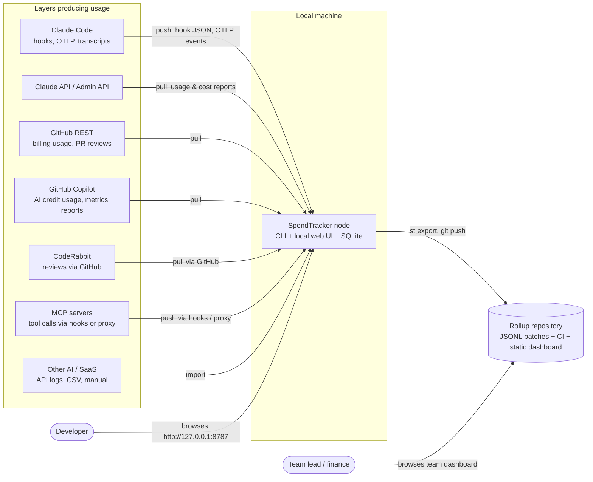
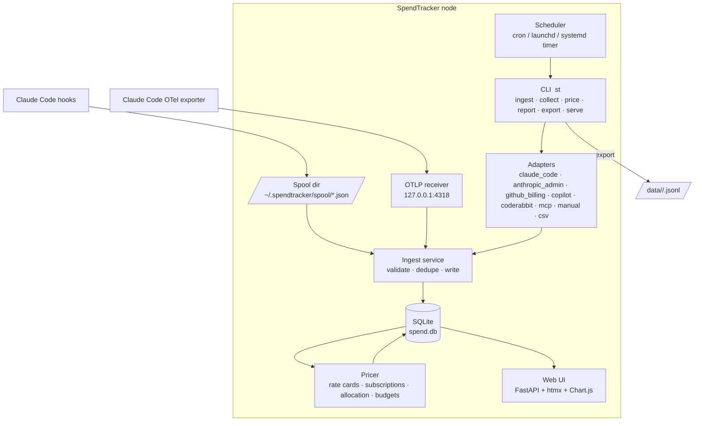
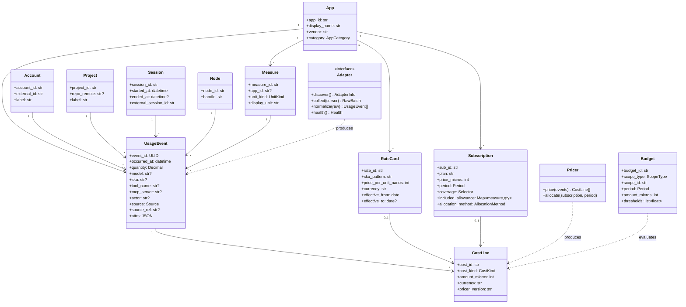
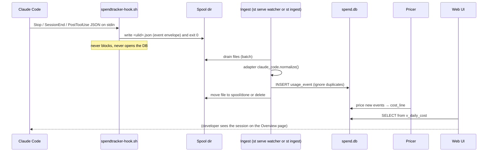
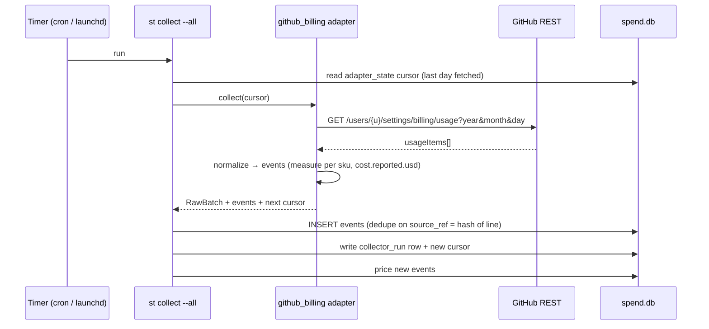
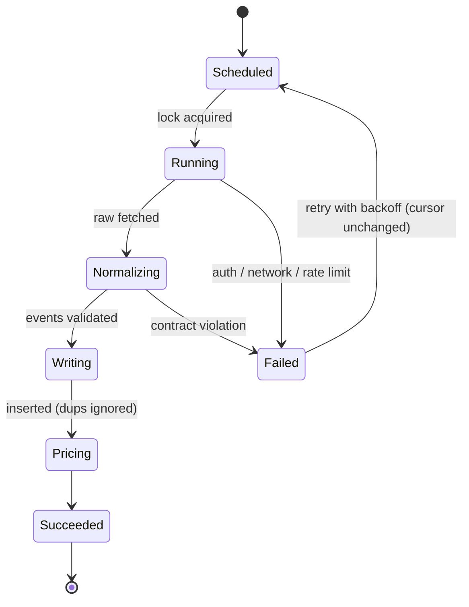

# Architecture

## 1. Goals and constraints

| Goal | How the architecture meets it |
| --- | --- |
| Capture each layer's native measure (tokens, minutes, requests, sessions, actions, credits, reviews) | One fact table keyed by a measure catalogue (ADR-0002). |
| Translate to money including subscriptions and budgets | Pricer with rate cards, subscriptions, allocation and budgets (ADR-0003, COST-MODEL.md). |
| Store locally in SQLite | Per-node database, WAL, spool-based ingest (ADR-0001). |
| Local web UI for trends, by app, by type, by currency | FastAPI + htmx pages over SQL views (WEB-UI.md). |
| Roll up many local users to a repository | Append-only JSONL export, git-based rollup, CI-built aggregate (ADR-0004, AGGREGATION.md). |
| Add layers incrementally | Adapter contract and conformance suite (ADR-0005, ADAPTER-SPEC.md). |
| Iterate without losing context | Context ledger, ADRs, phase playbook (PHASE-PLAYBOOK.md). |

Non-goals for the first releases: real-time streaming dashboards, enforcing spend limits inside the
tools, and scraping vendor invoices from web portals.

## 2. System context (D-CTX)



## 3. Container view (D-CONT)



Process model: `st serve` is one process hosting the web UI, the OTLP receiver, the spool watcher
and (optionally) the scheduler. Every other command is a short-lived process that opens the same
SQLite file. Hooks are shell scripts that only write files; they finish in milliseconds and never
block Claude Code.

## 4. Component view of the data path (D-COMP)

```mermaid
flowchart LR
    raw[Raw payload<br/>hook JSON · OTLP log record · API response · transcript line · CSV row]
    norm["normalize()<br/>adapter code"]
    ue[UsageEvent DTOs]
    val[Validator<br/>measure registered? UTC? quantity >= 0? source_ref stable?]
    dedupe[Dedupe<br/>unique on app+source+source_ref+measure]
    write[(usage_event)]
    price[Pricer<br/>list · reported · allocated · overage]
    cl[(cost_line)]
    views[SQL views<br/>v_daily_cost · v_budget_status · v_session_summary]
    api[JSON API<br/>/api/v1/series ...]
    ui[Pages<br/>Overview · Trends · Apps · Types · Sessions · Budgets]

    raw --> norm --> ue --> val --> dedupe --> write --> price --> cl --> views --> api --> ui
```



## 5. Domain model (D-CLASS)



## 6. Key flows

### 6.1 Claude Code hook to dashboard (D-SEQ-HOOK)



The same path handles OpenTelemetry: the OTLP receiver writes each `claude_code.api_request` and
`claude_code.tool_result` log record to the spool as an envelope with `source=otlp`.

### 6.2 Scheduled API pull (D-SEQ-PULL)



### 6.3 Collector run lifecycle (D-STATE)



## 7. Layering rules

1. `core` (schema, ingest, pricer, views) knows nothing about any app.
2. `adapters/*` depend on `core.api` only, never on each other.
3. `web` depends on SQL views and `core.api`; it never calls adapters.
4. `cli` orchestrates; it contains no business logic.
5. `rollup` reuses `core` to import batches into a second database with the same schema.

## 8. Runtime layout on disk

```
~/.spendtracker/
  config.toml            # node handle, reporting currency, enabled adapters, tokens by env var name
  spend.db               # SQLite (WAL: spend.db-wal, spend.db-shm)
  spool/                 # incoming hook / OTLP envelopes
  spool/failed/          # envelopes that failed validation, kept for inspection
  raw/                   # optional raw payload archive (off by default)
  exports/               # JSONL batches ready to commit to the rollup repo
  adapters/              # drop-in adapters
  logs/
```

## 9. Cross-cutting concerns

| Concern | Approach |
| --- | --- |
| Idempotency | Stable `source_ref` per adapter; unique index; ULID `event_id`. |
| Time | Store UTC; the UI converts with the node's timezone. Daily buckets are computed in the reporting timezone chosen in config. |
| Money | Integer micros + currency code; FX table for reporting currency. |
| Secrets | Tokens are referenced by environment variable name in `config.toml`; never stored in the DB or exports. |
| Privacy | Redaction levels applied at export (SECURITY-PRIVACY.md). Transcripts never leave the machine. |
| Observability of the tracker | `collector_run` table, `/health` endpoint, `st doctor`. |
| Versioning | Schema version in `schema_migration`; `pricer_version` on cost lines; `adapter_api_version` in manifests. |
