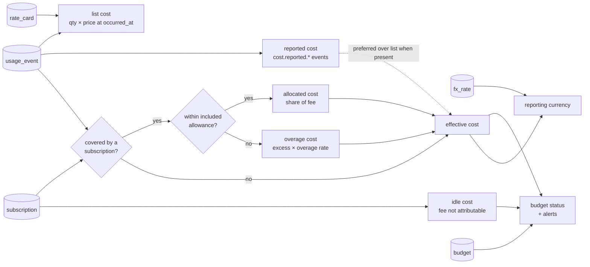

# Cost model: from measures to money

## 1. Pipeline (D-COST)

## 2. Definitions

Let `e` be an event with quantity `q`, measure `m`, app `a`, dimensions `d`, time `t`.

| Quantity | Definition |
| --- | --- |
| `rate(a, m, d, t)` | price per unit from the most specific `rate_card` whose `sku_pattern` matches `d.model` or `d.sku`, with the latest `effective_from ≤ t` and (`effective_to` null or `> t`). Tier defaults to `standard`; `sku` values like `fast` or `batch` select the matching tier. |
| `list(e)` | `q × rate`. If no rate exists, `list` is NULL and the event is flagged `unpriced` (visible in the UI). |
| `reported(e)` | sum of `cost.reported.*` events that share the event's `source_ref` group. Stored per group, attached to the `request.count` event of the group when one exists, otherwise to the first event. |
| `covered(e, s)` | true when subscription `s` is active at `t` and its `coverage` selector matches `a`, `m`, `account`. When several match, the most specific one (most selector fields) wins; ties go to the earliest `starts_at`. |
| `allowance(s, m, P)` | included quantity of `m` in period `P` (`included_allowance[m] × seats`). |
| `overage(e)` | for covered events: the part of `q` that exceeds the remaining allowance for `m` in `P`, in event time order, × the `overage` tier rate. If no allowance is defined for `m`, overage is 0 (unlimited plan). |
| `allocated(e)` | the share of `fee(s, P)` assigned to `e` by the allocation method (below). |
| `idle(s, P)` | `fee(s, P) − Σ allocated` when the method leaves part of the fee unassigned (no usage that period). Written as daily `idle` cost lines with `event_id NULL`. |
| `effective(e)` | `allocated + overage` if covered; else `reported` if present; else `list`. |
| `savings(e)` | `list − effective` (shown on the Apps page; it is the argument for or against the subscription). |

Fee normalization: annual subscriptions are spread evenly across months (`price / 12`); the period key
is `YYYY-MM`. Daily budgets use `fee / days_in_month`.

## 3. Allocation methods

| Method | Rule | Use when |
| --- | --- | --- |
| `usage_share` (default) | `allocated(e) = fee × list(e) / Σ list(covered events in P)`; if the denominator is 0, all of the fee becomes `idle` | A flat plan whose usage has meaningful list prices (Claude Max, Copilot) |
| `even_daily` | `fee / days` assigned to each day as an `idle` line regardless of usage; events get `allocated = 0` | Seats where usage is not the cost driver (GitHub Team seat) |
| `weights` | `fee × w(scope)` per project or user from `allocation_weights`; inside a scope, split by `usage_share` | Chargeback to teams or clients |
| `none` | subscription tracked for budget totals only; events keep list cost | Temporary, until a coverage rule is defined |

Allocation is recomputed for the whole period every time the pricer runs, because a new event
changes every other event's share. The pricer is idempotent: it deletes and rewrites `cost_line`
rows for `(period_key, sub_id)` inside one transaction.

## 4. Worked example (Claude Max under `usage_share`)

| | |
| --- | --- |
| Subscription | `claude_max_5x`, $100/month, coverage `apps: [claude_code]` |
| September usage | 120 requests; Σ list cost at Opus 5 rates = $260.00 |
| One request `r` | list $4.00 (400k cache-read tokens at $0.50/MTok plus output) |
| allocated(r) | 100 × 4 / 260 = $1.538 |
| effective(r) | $1.54 (no allowance defined, so no overage) |
| savings(r) | $2.46 |
| Month totals | list $260, effective $100, savings $160, idle $0 |

If the same month had only 2 requests totalling $3 list, effective would still sum to $100 (each
request carries a large share) and the Apps page would show a low utilization ratio (`Σ list / fee =
3 %`), the signal to downgrade.

## 5. Rate card maintenance

- Seed files in `schema/seed/rate_cards.example.yaml` are copied to `~/.spendtracker/rate_cards.yaml`
  on `st init`; `st rates apply` upserts them with `effective_from`.
- Vendor price changes are new rows with a new `effective_from`; never edit old rows.
- The team rollup repo carries the canonical rate cards; nodes pull them with `st rates sync`.
- `st rates check` lists events in the last 30 days with no matching rate (unpriced) and rate cards
  that are more than 180 days old with no successor, as a nudge to re-verify.
- Token prices are entered per million in seed files and stored per unit in **nano-currency**
  (`price_per_unit_nanos`): $5.00/MTok → 5000 nanos per token; Fable 5.1 cache read at $0.25/MTok →
  250 nanos. Cost lines are computed in nanos and rounded half-up to micros once per line, so rounding
  error is bounded by 0.5 micro-USD per event.

## 6. Budgets

- Scope × period × amount. Scopes: global, app, project, account, user, category.
- Consumption = Σ effective cost (including `idle` lines for the scope) in the period, converted to
  the budget currency.
- Thresholds (default 50 %, 80 %, 100 %) fire a `budget_alert` once per period. Delivery: UI banner,
  `st budget status` non-zero exit at 100 % (for use in shell prompts), desktop notification via
  `notify-send` / `osascript`, and an optional Claude Code `SessionStart` hook that injects
  "Budget X is at 92 %" as `additionalContext`.
- Forecast: run-rate (`spent / elapsed_days × days_in_period`) and a 7-day trailing average; the UI
  shows both and the day the budget is projected to hit 100 %.
- Budgets are informational; the tracker never blocks a tool.

## 7. Currency

- Every amount carries its currency. Reporting currency is set per node and per team.
- `fx_rate` rows are manual by default (`st fx set EUR USD 1.09 --as-of 2026-09-01`); an optional
  adapter pulls daily rates from a configurable public source.
- Conversion happens in the reporting views using the latest rate at or before the event day, so
  history is stable when new rates arrive.

## 8. Reconciliation

`invoice` rows are compared with `Σ effective` (plus `idle`) per app, account and period. The
Reconciliation page shows: computed, invoiced, delta, delta %, and the top three suspected causes
(unpriced events, collection gaps from `collector_run`, discount lines in raw GitHub data).

## 9. Pricer versioning

`pricer_version` is written on every cost line. A change to allocation math bumps it and `st reprice`
recomputes history; the UI can show "priced with v1" vs "v2" for the same period during migration.
