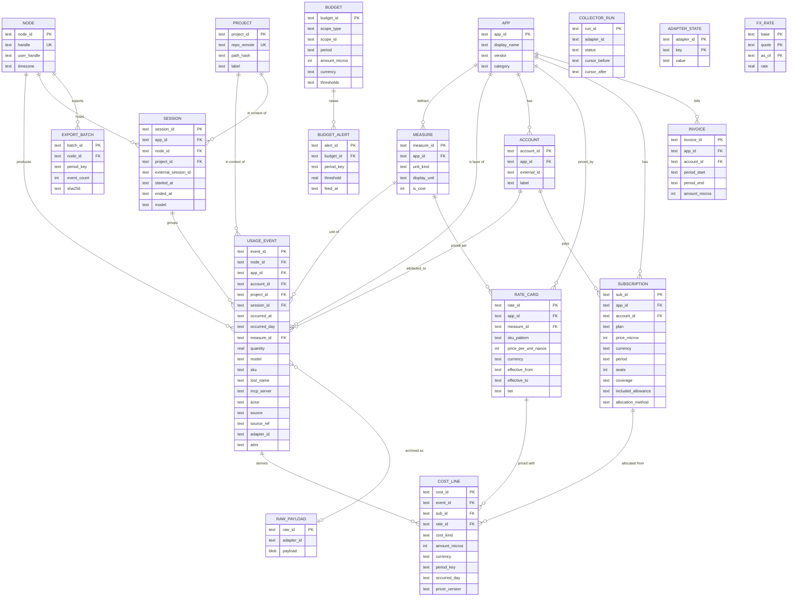

# Data model

The DDL is the source of truth: [`schema/001_core.sql`](../../schema/001_core.sql). This document
explains it. Every table exists in both the local database and the rollup database.

## 1. ERD (D-ERD)

## 2. Table dictionary

### Reference tables

| Table | Purpose | Notes |
| --- | --- | --- |
| `node` | One installation. | `handle` appears in export paths, so keep it short and stable. `hostname_hash` only. |
| `app` | A layer. | Seeded by adapters on first run. `category` drives the "by type" grouping in the UI alongside `measure.unit_kind`. |
| `measure` | Unit catalogue. | Generic measures have `app_id = NULL` (`token.input`, `session.count`). App-specific ones are prefixed (`copilot.ai_credit`, `action.minute.linux`). |
| `account` | The vendor-side identity the usage is billed to. | One user can have several (personal GitHub, org GitHub). |
| `project` | Repository or directory the usage happened in. | Resolved from `cwd` by the hook (`git remote get-url origin`), else `path_hash`. |
| `session` | A grouping the layer itself defines. | Claude Code session, CI workflow run, Copilot day (synthetic). |

### Facts

| Table | Purpose | Notes |
| --- | --- | --- |
| `usage_event` | Immutable observations. | Never updated; corrections are new events with `attrs.corrects = <event_id>` and a negative-quantity counterpart is **not** allowed (quantity ≥ 0). Instead, delete-and-reinsert by `source_ref` inside a transaction when a source re-sends a corrected line. |
| `raw_payload` | Optional archive. | Enables re-normalization after an adapter bug fix. Keyed by content hash. |

### Pricing

| Table | Purpose | Notes |
| --- | --- | --- |
| `rate_card` | Price per unit, effective-dated. | Lookup: most specific `sku_pattern` match, then latest `effective_from ≤ occurred_at`. Prices are stored per unit in nano-currency (Opus 5 input $5/MTok → 5000 nano-USD per token); cost lines round to micros. |
| `subscription` | Flat fees and allowances. | `coverage` JSON selects events; `included_allowance` maps measure to quantity per period; `allocation_method` picks the spreading rule. |
| `cost_line` | Derived money rows. | One row per (event, cost_kind). `idle` rows have `event_id = NULL` and carry unattributed subscription cost per day. Fully recomputable. |
| `fx_rate` | Conversion to reporting currency. | Applied in views by joining on `currency` and the latest `as_of ≤ occurred_day`. |
| `budget` / `budget_alert` | Allocations and threshold crossings. | Scopes: global, app, project, account, user, category. |

### Reconciliation and operations

| Table | Purpose |
| --- | --- |
| `invoice` | What the vendor actually charged; compared with computed effective cost per period. |
| `adapter_state` | Cursors and last-success timestamps per adapter. |
| `collector_run` | Audit of every collection attempt. Drives the Collectors health page. |
| `export_batch` | What was exported, with hash, for rollup idempotency. |
| `schema_migration` | Applied migration versions. |

## 3. Measure catalogue (initial)

| measure_id | app_id | unit_kind | Emitted by |
| --- | --- | --- | --- |
| `token.input` | NULL | count | claude_code, claude_api, copilot (post June 2026), any LLM adapter |
| `token.output` | NULL | count | same |
| `token.cache_read` | NULL | count | claude_code, claude_api |
| `token.cache_write` | NULL | count | claude_code, claude_api (5m and 1h are distinguished by `sku`) |
| `session.count` | NULL | count | claude_code (SessionStart), any |
| `active_time.s` | NULL | duration_s | claude_code (`claude_code.active_time.total`) |
| `request.count` | NULL | count | claude_api, any API-style adapter |
| `tool_call.count` | NULL | count | claude_code (PostToolUse, non-MCP tools) |
| `mcp.tool_call` | mcp | count | claude_code hooks with `mcp__*` matcher, MCP proxy |
| `mcp.duration_ms` | mcp | duration_s (stored in seconds) | same |
| `loc.added` / `loc.removed` | claude_code | count | OTel `claude_code.lines_of_code.count` |
| `commit.count` / `pr.count` | claude_code | count | OTel |
| `action.minute.<os>` | github | duration_s (stored as minutes × 60) | github_billing (`sku` keeps the exact runner SKU) |
| `storage.gb_month` | github | count | github_billing (Actions storage, Packages, LFS) |
| `codespaces.core_hour` | github | count | github_billing |
| `seat.count` | NULL | count | github_billing, copilot, coderabbit (seat snapshots per day) |
| `copilot.ai_credit` | copilot | count | copilot adapter, `/settings/billing/ai_credit/usage` |
| `copilot.premium_request` | copilot | count | copilot adapter, legacy endpoint (pre June 2026 history) |
| `copilot.suggestion.accepted` / `.shown` | copilot | count | copilot metrics reports (org/enterprise only) |
| `review.count` | coderabbit | count | coderabbit adapter (reviews by `coderabbitai[bot]`) |
| `review.comment` | coderabbit | count | same |
| `cost.reported.usd` | NULL | currency | any adapter whose source supplies a money amount |

Adapters register additional measures in their manifest; the ingest validator rejects unknown ones.

## 4. Attribution rules

1. **Project**: from `cwd` at hook time (git remote normalized to `host/org/repo`), from `repositoryName` on GitHub billing lines, from the PR's repository for CodeRabbit, otherwise NULL.
2. **Account**: from the credential used to collect (GitHub login, Anthropic org) or from the OTel `user.account_uuid` / `organization.id` attributes.
3. **Actor**: the person the usage is for. Defaults to `node.user_handle`; GitHub per-user billing lines and Copilot reports carry explicit logins.
4. **Session**: Claude Code `session_id`; GitHub Actions `run_id` when present in attrs; otherwise NULL.

## 5. Sizing and retention

| Item | Estimate |
| --- | --- |
| Claude Code heavy user | ~2,000 API requests/day × 5 measures = 10k events/day, ~3 MB/day in SQLite |
| GitHub billing | tens of lines/day |
| MCP | 100–1,000 events/day |
| Yearly, heavy user | ~4M rows, ~1.2 GB with indexes; well inside SQLite comfort |

Retention: `st compact --older-than 180d` collapses raw per-request events into daily aggregates
per (app, measure, model, sku, project) and deletes the originals; cost lines are recomputed from
the aggregates. Exports made before compaction are unaffected because the rollup keeps its own copy.

## 6. Migration policy

- Numbered files `schema/NNN_<name>.sql`, forward-only, idempotent where SQLite allows.
- A migration that adds a dimension column to `usage_event` must also add it to the export schema
  (AGGREGATION.md) and bump `export_schema_version`.
- `st migrate` refuses to run if the database version is newer than the binary.
