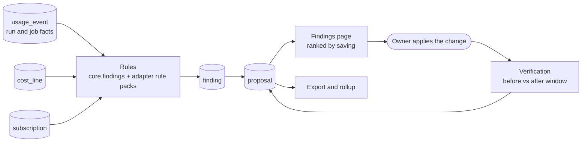
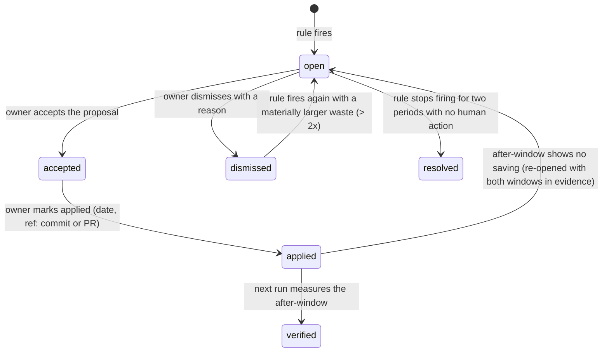

# Findings and proposals: from usage to changes

SpendTracker records what each layer consumed and what it cost. This document describes the layer
above that: **findings** (detected waste or risk with evidence and a quantified cost) and
**proposals** (concrete changes with an estimated saving), produced by **rules** that run over the
store. The first rule pack covers GitHub Actions and was derived from the 2026-09-06 analysis in
`docs/00-context/research/S3-github-actions-run-usage.md`. Decision record: ADR-0011.

## 1. Pipeline (D-FIND)



`st findings run [--rule id] [--scope project:github.com/o/r] [--period 2026-09]` evaluates every
enabled rule for every scope it applies to over the period, upserts findings by signature, and
(re)generates the proposals each finding's template defines. `st serve --with-scheduler` runs it
after every collector run that inserted events.

## 2. Concepts

| Term | Definition |
| --- | --- |
| **Rule** | A pure function `evaluate(ctx, scope, period) -> Finding[]` declared in a manifest. Reads the store through `ctx.query`; performs no network I/O. Has an id (`gha.sweep_dispatch`), the measures and attrs it reads, a severity function and one or more proposal templates. |
| **Rule pack** | The rules shipped by one adapter (`adapters/<id>/rules/`) or by the core (`core/findings/rules/`). Listed in `adapter.yaml` under `rules:`. |
| **Scope** | What a finding is about: `project` (repository), `app`, `account`, `session` (one run), `subscription`, `workflow` (project + workflow path), `actor`. Stored as `scope_type` + `scope_key`. |
| **Finding** | One detected instance of a rule over a scope and period: `signature`, `severity`, `title`, `detail`, `evidence` (JSON), `waste_quantity` + `measure_id`, `waste_micros` + currency, lifecycle status. |
| **Proposal** | One change attached to a finding: `title`, `action` (what to edit, in prose plus optional patch hints), `est_saving_quantity`, `est_saving_micros` per period, `basis` (`measured` / `extrapolated` / `assumed`), `window` the estimate comes from, `effort` (`trivial` / `small` / `medium` / `large`), `risk` note, lifecycle status, verification result. |
| **Signature** | `sha256(rule_id, scope_type, scope_key, period_key, discriminator)` where the discriminator is rule-defined (a workflow path, a PR number, a job name). Human state attaches to the signature and survives recomputation. |
| **Waste** | The part of a measured quantity the rule judges avoidable, priced with the same rate card as the events (list) or the reported cost share. Rules must state the counterfactual in `evidence.counterfactual`. |

## 3. Lifecycle



Recomputation rules: a run that finds the same signature updates `last_seen_at`, `evidence`,
`waste_*` and the proposal estimates but never touches status, notes, `applied_at`, `applied_ref`.
A run that does not find a previously open signature leaves it `open` until two consecutive periods
miss it, then marks it `resolved`.

## 4. Rule contract (enforced by the conformance suite)

| Rule | Check |
| --- | --- |
| `evaluate` performs no network I/O and no writes | run under the same sandbox as `normalize` |
| Every finding has a stable signature across two evaluations of the same store | fixture replayed twice |
| Every finding has `evidence.counterfactual` and at least one evidence row id | schema check |
| Every proposal has `basis` and, for `extrapolated`, a `window` | schema check |
| Measures and attrs the rule reads are declared in its manifest | static check |
| The golden fixture (`examples/findings/<pack>-<case>.jsonl`) reproduces the expected findings and proposals | `st findings test <pack>` |
| Severity is deterministic from the evidence | replay |

Manifest entry (`adapter.yaml` or `core/findings/rules.yaml`):

```yaml
rules:
  - id: gha.sweep_dispatch
    title: Scheduled sweep dispatches full CI on a stale draft
    reads:
      measures: [action.job.seconds]
      attrs: [workflow_path, event, branch, head_sha, pr_number, pr_draft, triggering_actor]
    scope: workflow
    severity: {minor: 60, major: 600, critical: 1800}   # waste minutes per period
    proposals:
      - template: close_or_rebase_draft
      - template: sweep_skip_stale_drafts
```

## 5. Rule catalogue

### 5.1 GitHub Actions pack (`adapters/github_actions_runs/rules/`)

Each rule below is stated with its detection, counterfactual, and the 2026-09 instance that
motivated it. Minutes are paid runner minutes (self-hosted = 0).

| Rule id | Detects | Counterfactual (waste) | 2026-09 instance |
| --- | --- | --- | --- |
| `gha.sweep_dispatch` | `workflow_dispatch` runs triggered by `github-actions[bot]` on a head that belongs to a draft PR, repeated across pushes | all such run seconds | MAX3 `CI webhook fallback` → 8 full pyramids on PR #1596, 337 min |
| `gha.per_push_heavy_job` | A job whose median duration exceeds a threshold (default 5 min) and runs on every `synchronize` of a PR | seconds beyond one run per PR per day | Maxresearchcollective `Checks :: mutation-changed`, 452 min; MAX3 backend shards, 699 min |
| `gha.duplicate_gate_on_deploy` | A `push`-to-default-branch workflow whose job names repeat a job set that already succeeded on the same tree SHA in a `pull_request` or push run | the repeated jobs' seconds | Maxresearchcollective deploy gate shards, 300 min |
| `gha.slow_transfer_step` | A step named upload/deploy/sync whose duration exceeds a threshold (default 5 min) on every run | seconds above 2 min per run | Maxresearchcollective `deploy :: Upload to IONOS over SFTP`, 184 min |
| `gha.cancelled_work` | Jobs with `conclusion = cancelled` whose run was superseded by a newer run on the same concurrency group within N minutes | all cancelled seconds | 288 min across repos; four runs in 12 minutes on `fix/ollama-keepalive` |
| `gha.reviewer_per_push` | A workflow matching a reviewer lane (name or path) triggered on `synchronize` with median duration above 2 min | seconds beyond one run per PR | Maxresearchcollective Gemini lane, 205 min over 48 runs |
| `gha.full_matrix_on_synchronize` | A matrix job set (≥ 3 shards) that runs on `synchronize` and again on `ready_for_review` | shard seconds on synchronize events after the first | MAX3 backend 4-shard pyramid on 14 pushes in three hours |
| `gha.failed_run_over_threshold` | A failed or timed-out run above 30 min | full run seconds, flagged `risk` not waste | MAX3 huggingface run, 87 min (ENOSPC) |
| `gha.unattributed_spend` | Reported Actions cost on the billing lines (`github_billing`) not matched by run-level events for the same repository and day | reported minus measured | "All other repositories", $12.07, no visible runs |
| `gha.paid_workflow_on_public_repo` | Paid job seconds on a public repository (dynamic agent workflows are billed) | informational | SpendTracker Copilot code review, 13 min |

Rules that were considered and rejected after measurement: a "scheduled polling" rule (350 sweep
runs cost 33 min because billing is per second; kept as informational under `gha.schedule_density`
with severity `info` only).

### 5.2 Core pack (`core/findings/rules/`)

| Rule id | Detects | Source |
| --- | --- | --- |
| `sub.low_utilization` | `Σ list / fee` for a subscription below 25 % for a full period | COST-MODEL.md §4 ("the signal to downgrade") |
| `sub.overage_exceeds_upgrade` | overage cost in a period exceeds the price difference to the next plan in `default_subscriptions` | COST-MODEL.md §2 |
| `price.unpriced_events` | events with no rate card in the period | COST-MODEL.md §5 |
| `collect.gap` | a day with no `collector_run` success for an enabled pull adapter | ARCHITECTURE.md §6.3 |
| `budget.forecast_breach` | forecast crosses 100 % before period end | COST-MODEL.md §6 |

### 5.3 Claude Code and MCP packs (designed, not yet motivated by a measurement)

`cc.repeated_large_read` (same file read more than N times in one session), `cc.max_turns_no_output`
(a session or CI reviewer run that hits its turn cap without posting), `mcp.error_rate`
(> 20 % `mcp.error` for a server per day). Each becomes a rule when a research note records a
measured instance, following the pattern in §5.1.

## 6. Estimating savings

- `est_saving_quantity = waste_quantity × (days_in_period / days_measured)` for
  `basis = extrapolated`; the `window` records the measured days.
- `est_saving_micros` prices the quantity with the same rate card as the events and, when a
  subscription with an included allowance covers the measure, reports the part inside the allowance
  as "allowance freed" rather than money.
- Overlapping proposals (two rules explaining the same seconds) are flagged with `overlaps_with`
  and the page sums the max, not the total. A run id can belong to the evidence of several findings.
- Verification: when a proposal is marked applied with a date, the next `st findings run` compares
  the same rule's waste over `[applied_at, applied_at + window]` with the before-window and stores
  `verification = {before, after, delta, measured_at}`; status becomes `verified` when the delta is
  at least 50 % of the estimate, otherwise the finding reopens with both windows in evidence.

## 7. CLI and API

| Command / endpoint | Purpose |
| --- | --- |
| `st findings run [--period] [--rule] [--scope]` | Evaluate rules; idempotent per signature |
| `st findings list [--status open] [--min-saving 60]` | Ranked table: rule, scope, waste, proposal, estimated saving, basis |
| `st findings show <id>` | Evidence rows, counterfactual, proposals, history |
| `st proposals accept|dismiss|applied|verify <id> [--ref PR-url] [--note]` | Lifecycle transitions |
| `st findings test <pack>` | Replay the pack's golden fixtures |
| `st findings export --format md|jsonl [--github-issues]` | Report for a PR or a team; issues are created only for `accepted` proposals |
| `GET /api/v1/findings?status&scope&min_saving` · `GET /findings/{id}` · `PATCH /proposals/{id}` | Same over HTTP for the page |

## 8. UI

**Findings** page (WEB-UI.md): a ranked list of proposals with estimated saving per period and
basis badge, grouped by scope, with filters for rule pack, status and severity; a finding detail
drawer with the evidence table (run ids link to the vendor page), the counterfactual sentence, and
the lifecycle buttons. The Overview page shows one tile: "Open proposals: N, est. saving X / month".

## 9. Testing

- Unit: each rule against a hand-built in-memory store (tier `unit`).
- Golden: `examples/findings/<pack>-<case>.jsonl` replayed by `st findings test` (tier
  `integration`). The first golden case is `github-actions-2026-09.jsonl`.
- Invariant (CT): every open finding's evidence row ids exist in `usage_event`; every proposal with
  `basis = extrapolated` has a window; sum of a rule's waste never exceeds the measured quantity for
  its scope.
- System: `st findings run` after a fixture-replayed `github_actions_runs` collection produces the
  golden findings end to end.

## 10. Privacy

Evidence may contain branch names, PR numbers and workflow paths. Redaction level `team` keeps
them; `public` hashes branch names and drops PR titles (SECURITY-PRIVACY.md). Evidence never
contains commit messages or file contents.
