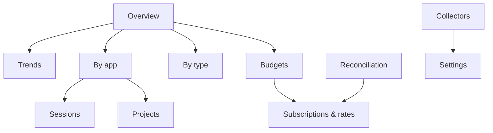

# Local web interface

`st serve` binds `http://127.0.0.1:8787` (loopback only, no auth). The UI is server-rendered with
htmx partials and Chart.js. All numbers come from SQL views; the pages are thin.

## 1. Navigation (D-UI)

## 2. Pages

| Page | Question it answers | Main widgets | Source view |
| --- | --- | --- | --- |
| **Overview** | Where am I this month? | Effective spend vs budget (all budgets as progress bars with forecast marker); stacked daily area by app; "savings vs list" tile; top 5 projects; unpriced-events warning; stale collectors warning | `v_daily_cost`, `v_budget_status`, `collector_run` |
| **Trends** | How is it moving? | Line/area per app or measure over day/week/month buckets; period comparison (this vs last); moving average; toggle effective / list / reported | `v_daily_cost`, `v_daily_usage` |
| **By app** | Which layer costs what, in its own units and in money? | One card per app: native measures (tokens by type, minutes by runner, credits, reviews, MCP calls), effective vs list, utilization of its subscription, drill into model/sku breakdown | `v_daily_usage`, `v_daily_cost`, `subscription` |
| **By type** | Which kind of unit drives spend? | Grouping by `measure.unit_kind` and by `app.category`: tokens vs minutes vs actions vs seats; treemap of effective cost | `v_daily_usage` joined to `measure` |
| **Sessions** | What did a session cost? | Table of sessions (app, project, model, tokens, MCP calls, list, effective); session detail timeline of events | `v_session_summary` |
| **Projects** | Which repo consumes what? | Per-project cost across apps (Claude Code tokens + Actions minutes + CodeRabbit reviews on the same repo) | `v_daily_cost` grouped by project |
| **Budgets** | Am I on track? | Budget list with period, spent, forecast, alerts; create/edit form | `v_budget_status`, `budget_alert` |
| **Subscriptions & rates** | What are my plans and prices? | Subscription editor (coverage, allowance, allocation method); rate card table with effective dates; "apply seed" and "sync from team" buttons | `subscription`, `rate_card` |
| **Collectors** | Is data flowing? | Adapter status cards: last run, lag, events inserted, errors, next run; "run now" | `collector_run`, `adapter_state` |
| **Reconciliation** | Does computed match invoiced? | Per app/period: invoiced vs computed, delta, suspected causes; invoice entry form | `invoice`, `cost_line` |
| **Settings** | Node config | Handle, timezone, reporting currency, redaction default, enabled adapters, token env var names (values never shown) | `config.toml` |

Global filters (persisted in the URL): date range, app, project, currency display, cost kind.

## 3. JSON API

Served under `/api/v1`; the pages call the same endpoints via htmx so the API is exercised by the UI.

| Endpoint | Purpose |
| --- | --- |
| `GET /series?metric=effective&group=app&bucket=day&from&to&filters...` | Time series for charts. `metric` ∈ effective, list, reported, allocated, overage, quantity (with `measure=`) |
| `GET /breakdown?by=app|measure|model|sku|project|mcp_server|actor&from&to` | Totals for tables and treemaps |
| `GET /sessions?...`, `GET /sessions/{id}` | Session list and detail |
| `GET /budgets`, `POST /budgets`, `PATCH /budgets/{id}` | Budget CRUD |
| `GET /subscriptions`, `POST ...`, `GET /rates`, `POST /rates` | Pricing admin |
| `POST /ingest` | Accepts an array of usage-event envelopes (used by out-of-process adapters and the mcp-proxy) |
| `POST /otlp/v1/logs`, `POST /otlp/v1/metrics` | OTLP/HTTP JSON receiver (also mounted at `/v1/logs` and `/v1/metrics` for exporters that do not allow a path prefix) |
| `GET /collectors`, `POST /collectors/{adapter}/run` | Health and manual trigger |
| `GET /health` | Liveness, schema version, DB path, spool depth |
| `GET /export?period=YYYY-MM` | Streams the JSONL export |

All money in the API is `{ "micros": 1234567, "currency": "USD" }`; the UI formats.

## 4. Static mode

`st site build --out site/` renders every page with its data pre-fetched into JSON files so the
rollup repo can publish the same UI without a server. Interactive filters work client-side within
the pre-built date range (default: trailing 13 months).

## 5. Visual design rules

- One accent per app, consistent across every chart (defined once in `apps.yaml` seed).
- Effective cost is always the solid series; list cost is dashed; reported is dotted.
- Every chart has a "download CSV" of its series.
- No external network requests from the UI (fonts, scripts and Chart.js are vendored).
- Dark and light themes follow the OS.

## 6. Performance targets

| Scenario | Target |
| --- | --- |
| Overview with 4M events | < 300 ms server time (views are indexed by `occurred_day`) |
| Trends, 13 months by day, 6 apps | < 500 ms |
| Session detail, 5k events | < 200 ms |

If targets are missed, the fix is a materialized daily table maintained by the pricer, not caching in
the web layer.
