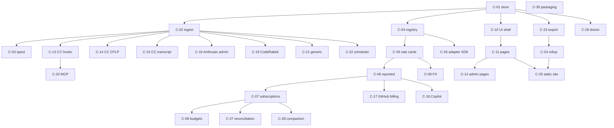

# Capabilities: separately deliverable units

Each capability is independently buildable, testable and shippable behind its own CLI command,
page or adapter. Vertical slices (VERTICAL-SLICES.md) pick a thin path through several of them.

## Catalogue

| Id | Capability | Deliverable | Depends on | Tests that prove it |
| --- | --- | --- | --- | --- |
| C-01 | Core store and migrations | `st init`, `st migrate`, `schema/*.sql`, DB helpers | — | migration up on empty and populated DB; schema snapshot test |
| C-02 | Canonical ingest | `core.ingest`, `st ingest` (stdin/JSON/spool), `POST /api/v1/ingest` | C-01 | validator unit tests; idempotency property test |
| C-03 | Spool and watcher | spool dir, atomic writes, failed/ quarantine, watcher in `st serve` | C-02 | crash-mid-write test; duplicate file test |
| C-04 | Measure and app registry | seed loading from manifests, `st measures list` | C-01 | unknown-measure rejection |
| C-05 | Rate cards and list pricing | `rate_card`, pricer `list` kind, `st rates apply/check/sync`, seed YAML | C-01, C-04 | rate lookup precedence tests; nano→micro rounding tests |
| C-06 | Reported cost | `cost.reported.*` measures → `reported` cost lines | C-05 | GitHub netAmount fixture |
| C-07 | Subscriptions and allocation | `subscription`, coverage selectors, `usage_share`/`even_daily`/`weights`, `idle` lines, `st reprice` | C-05 | worked example from COST-MODEL §4 as a golden test; conservation test (Σ allocated + idle = fee) |
| C-08 | Budgets and alerts | `budget`, `v_budget_status`, forecast, thresholds, notifications, `st budget status` | C-07 | threshold-once-per-period test; forecast math |
| C-09 | Currency and FX | `fx_rate`, reporting currency conversion in views, `st fx set` | C-05 | conversion picks latest rate ≤ day |
| C-10 | Web UI shell and Overview | `st serve`, layout, filters, Overview page, `/api/v1/series`, `/breakdown` | C-01, C-05 | Playwright smoke; API contract tests |
| C-11 | Trends, By app, By type, Sessions, Projects pages | pages and partials | C-10 | snapshot tests of rendered partials with fixture DB |
| C-12 | Budgets, Subscriptions & rates, Collectors, Reconciliation, Settings pages | admin pages | C-10, C-07, C-08 | form round-trip tests |
| C-13 | Claude Code adapter: hooks | hook script, settings snippet, `st hooks install`, session/project attribution, MCP call parsing | C-02, C-03 | fixture replay; hook timing test (< 50 ms) |
| C-14 | Claude Code adapter: OTLP receiver | `/otlp/v1/logs`, `/v1/metrics`, cumulative→delta, content-attribute dropping | C-02 | recorded OTLP JSON fixtures; double-count guard test |
| C-15 | Claude Code adapter: transcript parser and backfill | offset cursors per file, `st backfill claude-code` | C-02 | fixture transcripts; resume-from-offset test |
| C-16 | Anthropic Admin API adapter | usage_report + cost_report pull | C-02, C-05 | respx fixtures; cursor test |
| C-17 | GitHub billing adapter | usage report pull, sku→measure mapping, trailing-3-day refetch | C-02, C-06 | fixtures for Actions/Storage/Codespaces lines |
| C-18 | Copilot adapter | ai_credit + premium_request billing pull; metrics reports download | C-02, C-06 | fixtures both regimes |
| C-19 | CodeRabbit adapter | reviews/comments by bot login across configured repos | C-02 | fixtures; pagination cursor |
| C-20 | MCP adapter and proxy | hook-based counting, `st mcp-proxy` stdio/HTTP | C-13 | proxy passthrough byte-equality test; latency capture |
| C-21 | Generic adapters | `csv_import` with mapping YAML, `manual`, `otlp_generic`, `sdk_usage_log` | C-02 | mapping tests |
| C-22 | Scheduler integration | `st schedule install` (launchd/systemd/schtasks), `st collect --all`, `collector_run` audit | C-02 | dry-run tests per platform; lock test |
| C-23 | Export | `st export`, JSONL + manifest, redaction levels, `export_batch` | C-01 | JSON-schema validation; redaction snapshot per level |
| C-24 | Rollup build | `st rollup build`, team YAML application, idempotent import, compaction | C-23, C-07 | rebuild twice → identical DB; conservation across nodes |
| C-25 | Static site | `st site build`, pre-computed JSON, Pages workflow | C-11, C-24 | build in CI; link check |
| C-26 | Adapter SDK, conformance suite, scaffold | `core.api`, `st adapter test/new`, manifest schema | C-02, C-04 | suite runs on every built-in adapter |
| C-27 | Reconciliation | `invoice`, `st invoice add`, Reconciliation page causes | C-06, C-07, C-12 | delta and cause detection fixtures |
| C-28 | Retention and compaction | `st compact`, aggregate rows, cost recompute | C-07 | totals preserved before/after |
| C-29 | Tracker observability | `st doctor`, `/health`, structured logs | C-01 | doctor detects missing hooks, stale collectors, token-looking config values |
| C-30 | Packaging and self-update | wheel, `pipx`/`uv tool`, `st upgrade`, release workflow | — | install smoke on macOS/Linux/Windows runners |

## Dependency graph (D-CAPDEP)

## Ownership of state per capability

| Capability | Tables it writes | Tables it reads |
| --- | --- | --- |
| C-02 ingest | usage_event, session, project, account, raw_payload | measure, app, node |
| C-05/06/07 pricer | cost_line | usage_event, rate_card, subscription, fx_rate |
| C-08 budgets | budget, budget_alert | cost_line |
| C-13..C-21 adapters | (none directly; via ingest) | adapter_state |
| C-22 scheduler | collector_run, adapter_state | — |
| C-23 export | export_batch | usage_event, session, project, account |
| C-24 rollup | all, in rollup.db | export files, team YAML |

No two capabilities write the same table except through `core.ingest` and the pricer, which keeps
the concurrency story simple.
