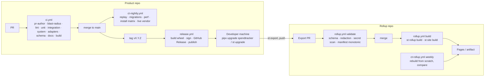

# CI, CD and CT

Two repositories are involved: the **product repo** (this one) and each team's **rollup repo**.
Templates live in `examples/ci/`; copy them into `.github/workflows/` when the first code lands.

## Pipeline (D-PIPE)

## Product repo workflows

### `ci.yml` (pull requests and main)

The template is `examples/ci/ci.yml`; slice S0 installs it as `.github/workflows/ci.yml` together
with the `.github/actions/ci-issues` composite action it references (ADR-0008, SESSION-PROTOCOL.md).
Jobs, in the order they run:

| Job | Steps |
| --- | --- |
| pr-author | Fail unless `github.event.pull_request.user.login` equals the repository variable `PR_AUTHOR_LOGIN` (the owner's username). Hard rule. Skipped on pushes to `main`. |
| blast-radius | Diff the PR against its base; apply `examples/ci/blast-radius.yaml`; output `tiers` (subset of unit, integration, system) and `selectors`; force `full=true` when a `ci_full_run_paths` entry changed, on pushes to `main`, on label `full-ci` or `[full-ci]` in a commit message; write the selection to the job summary. Unmapped paths select the full matrix and add a warning. |
| lint | `uv sync`, `ruff check`, `ruff format --check`, `mypy src` |
| unit | `pytest -m unit <selectors>` (or everything when full); JUnit XML |
| integration | `pytest -m integration <selectors>`; JUnit XML |
| system | `pytest -m system <selectors>` (hook → spool → ingest → pricer → UI on a temp DB; Playwright smoke with Chromium); JUnit XML |
| adapters | `st adapter test --all`; runs on a full run or when an adapter test path is selected |
| schema | apply `schema/*.sql` to an empty DB; diff the sorted `.schema` output against `tests/schema_snapshots/head.sql` |
| docs | offline markdown link check (lychee) over `docs/**/*.md` and `README.md`; ensure every ADR is listed in `docs/README.md`. Planned, not in the template yet: mermaid parse check; fail if `CONTEXT.md` was not modified on a PR labelled `phase-close` |
| build | needs lint, unit, integration, system: `uv build`; upload the wheel; `pipx install dist/*.whl && st doctor` |
| ci-issues (composite action) | On any tier failure: `examples/ci/ci-issues.py` converts JUnit reports into `ci-issues.jsonl` (check, test id, signature, message, paths), uploads the artifact, posts one PR comment listing the signatures with the `issue.sh` command to record each |

A tier that was skipped by blast radius reports success with the summary line "skipped by blast
radius, no affected paths", so required checks stay green without running. Tests run on Linux;
the nightly install matrix covers macOS and Windows.

Branch protection on `main` requires pr-author, lint, unit, integration, system, adapters, schema
and build (`.github/rulesets/main-protection-with-checks.json`); `blast-radius` and `docs` run but
are not required, so a docs-only change cannot be blocked by a flaky link check.

### `ct-nightly.yml` (schedule)

Runs the CT jobs from TESTING.md. Each failure opens or updates a single issue labelled `ct`
(deduplicated by job name). The live vendor job runs only when secrets are configured for the
runner and always in read-only mode.

### `release.yml` (tags `v*`)

1. Verify tag matches `pyproject.toml` version.
2. Build wheel and sdist; generate SBOM; sign with Sigstore.
3. Create a GitHub Release with changelog from `CHANGELOG.md` (kept by hand, one line per capability).
4. Publish to the package index the team uses (PyPI or a private index).
5. Trigger `ct-install` against the published version.

### CD to developer machines

There is no server to deploy. Continuous delivery means the developer runs `st upgrade` (or
`pipx upgrade spendtracker`), which pulls the latest release and runs `st migrate`. `st doctor`
reports if the DB schema is ahead of the binary. Hooks are re-installed with a diff shown.

## Rollup repo workflows

### `rollup.yml`

| Trigger | Job | Steps |
| --- | --- | --- |
| PR touching `data/**` | validate | JSON-schema validation of every changed `.jsonl`; manifest `sha256` matches; `last_event_id` monotonic vs main; redaction level ≥ node minimum; secret scan; size guard (reject > 50 MB per file) |
| push to `main` | build | `pipx install spendtracker==<pinned>`; `st rollup build --repo . --out rollup.db`; `st site build --db rollup.db --out site/`; upload `rollup.db` as an artifact; deploy `site/` to GitHub Pages (private repos: keep as artifact or publish to an internal host) |
| push to `main` touching `team/**` | build | same as above, because rate cards and subscriptions changed the pricing |

### `ct-rollup.yml` (weekly)

Rebuilds from scratch into a temporary DB and compares per-day, per-app effective sums with the
incremental artifact. Differences open a `ct` issue.

## Data in CI

- Product repo tests never need vendor tokens; fixtures are enough.
- The rollup build needs no secrets at all; the data is already in the repo.
- Live vendor checks are the only jobs with tokens and they run only on a designated runner.

## Environments and secrets summary

| Secret | Where | Used by |
| --- | --- | --- |
| Package index token | product repo, release environment | release.yml |
| Read-only vendor tokens | designated CT runner | ct-live |
| Pages deploy | rollup repo | rollup.yml |

## Versioning and compatibility gates

- Schema version, export schema version, adapter API version and pricer version are printed by
  `st version --all` and asserted by CI against `CONTEXT.md`'s current state table (a doc test parses
  the table).
- A PR that changes `schema/` must add a snapshot and a migration test.
- A PR that changes the export line schema must bump `export_schema_version` and update
  `schema/export-v1.schema.json` (or add v2) and the rollup validator.
