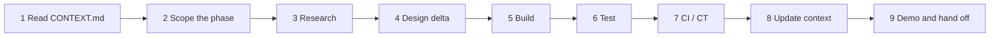

# Phase playbook: running any phase without losing context

A phase is one pass through a slice (or part of one), or a research, redesign or update effort.
Phases are executed by people, by AI coding sessions, or both. The playbook exists because context
does not survive between sessions unless it is written down in known places.

## The context contract

| Artifact | Purpose | Updated when |
| --- | --- | --- |
| `docs/00-context/CONTEXT.md` | Current state, next actions, decisions log, open questions, phase history | End of **every** phase, and mid-phase when a decision is made |
| `docs/00-context/adr/ADR-NNNN-*.md` | Decisions with rationale and alternatives | Any time a design choice is made or reversed |
| `docs/00-context/research/<slice>-<topic>.md` | Findings from research with dates and sources | During research steps |
| `docs/01-architecture/*.md` | The design | When the design changes; never left describing a different system than the code |
| `docs/02-delivery/*.md` | The plan | When scope or order changes |
| Code comments `# CONTEXT:` | Pointers from code to the ADR or doc section that explains a non-obvious choice | While building |
| Commit messages | `S<slice>/<capability>: <what>` prefix, body links to the ADR or research note | Every commit |

## Phase steps



### 1. Read
Read `CONTEXT.md` fully, then the slice section in VERTICAL-SLICES.md, then only the architecture
documents the slice touches. Do not start from the code.

### 2. Scope
Write a short phase brief at the top of a new research note or in the PR description:
goal, capabilities in scope, out of scope, exit criteria copied from the slice, questions to answer.

### 3. Research
Verify external facts before building against them (vendor endpoints, hook payloads, prices). Record
in `docs/00-context/research/<slice>-<topic>.md`:

```
# <Title>
Date: YYYY-MM-DD   Verified against: <urls>   Author: <person or session>
## Findings
## Surprises (things that contradict current docs)
## What this changes
- docs updated: ...
- ADR needed: yes/no
```

### 4. Design delta
Update the architecture document(s) first, then write or supersede an ADR if a decision changed.
A PR that changes behavior without touching docs is incomplete.

### 5. Build
Small commits, capability-prefixed. Keep the layering rules (ARCHITECTURE §7). Add `# CONTEXT:`
comments where a reader would otherwise ask "why".

### 6. Test
Per TESTING.md: unit for logic, fixtures for adapters, property tests for invariants, one UI smoke
per page touched. Add fixtures to the nightly replay set.

### 7. CI / CT
CI must be green. If the phase adds an adapter or a schema change, add the corresponding CT job
(fixture replay, migration replay).

### 8. Update context
In `CONTEXT.md`: current state, next actions, decisions log rows, open questions (answered or new),
research notes table, phase history row. This is the last commit of the phase and it is mandatory.

### 9. Demo and hand off
Run the slice's demo script. Paste the outcome into the PR. Merge.

## Kickoff prompt for an AI session

Copy this to start any phase with an AI coding assistant:

```
You are continuing work on SpendTracker. Before doing anything:
1. Read docs/00-context/CONTEXT.md in full.
2. Read the section for the active slice in docs/02-delivery/VERTICAL-SLICES.md.
3. Read docs/02-delivery/PHASE-PLAYBOOK.md and follow its steps in order.
4. Read only the architecture docs the slice touches.
Goal for this phase: <one sentence>.
Constraints: keep the layering rules in ARCHITECTURE.md §7; no new dependencies without an ADR;
every external fact you rely on must be recorded in a research note with a date and source.
Finish by updating CONTEXT.md (current state, decisions, open questions, phase history) and
listing exactly which documents you changed.
```

## Close checklist

- [ ] Exit criteria from the slice met and demonstrated
- [ ] Docs describe the system as built
- [ ] ADRs added or superseded for every decision
- [ ] Research notes end with "What this changes"
- [ ] Tests added; fixtures added to CT replay
- [ ] CI green; CT jobs updated if needed
- [ ] `CONTEXT.md` updated (state, next, decisions, questions, history)
- [ ] PR description contains the demo output

## Redesign and update phases

A redesign phase follows the same steps with these differences: step 3 records **why** the current
design fails (with evidence: a failing test, a measurement, a vendor change); step 4 supersedes the
affected ADRs rather than editing them; step 5 may be empty (docs-only phase). The phase history row
in `CONTEXT.md` is marked `redesign`.

## Working with multiple people or sessions at once

- One slice per branch; capabilities inside a slice can be parallel branches when their tables do not
  overlap (see CAPABILITIES.md "Ownership of state").
- `CONTEXT.md` conflicts are resolved by keeping both rows; it is a ledger, not a state machine.
- An AI session must not close a phase (step 8) for work it did not verify with a test run.
