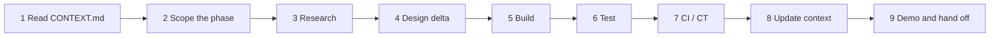

# Phase playbook: running any phase without losing context

A phase is one pass through a slice (or part of one), or a research, redesign or update effort.
Phases are executed by people, by AI coding sessions, or both. The playbook exists because context
does not survive between sessions unless it is written down in known places.

## The context contract

| Artifact | Purpose | Updated when |
| --- | --- | --- |
| `docs/00-context/CONTEXT.md` | Current state, next actions, decisions log, open questions, phase history | End of **every** phase, and mid-phase when a decision is made |
| `docs/00-context/adr/ADR-NNNN-*.md` | Decisions with rationale and alternatives | Any time a design choice is made or reversed |
| `docs/00-context/research/<slice>-<topic>.md` | Findings from research with dates and sources | During research steps |
| `docs/01-architecture/*.md` | The design | When the design changes; never left describing a different system than the code |
| `docs/02-delivery/*.md` | The plan | When scope or order changes |
| Code comments `# CONTEXT:` | Pointers from code to the ADR or doc section that explains a non-obvious choice | While building |
| Commit messages | `S<slice>/<capability>: <what>` prefix, body links to the ADR or research note | Every commit |

## Phase steps (D-PHASE)



### 1. Read
Fable sessions read `CONTEXT.md` fully, then the slice section in VERTICAL-SLICES.md, then the
architecture documents the slice touches, and write the packet from them. Builder sessions read
`docs/PROCESS.md`, their packet, then the packet's reading list in order (ADR-0010); the start hook
injects the part of `CONTEXT.md` they need. Nobody starts from the code.

### 2. Scope
Write a short phase brief at the top of a new research note or in the PR description:
goal, capabilities in scope, out of scope, exit criteria copied from the slice, questions to answer.

### 3. Research
Verify external facts before building against them (vendor endpoints, hook payloads, prices). Record
in `docs/00-context/research/<slice>-<topic>.md`:

```
# <Title>
Date: YYYY-MM-DD   Verified against: <urls>   Author: <person or session>
## Findings
## Surprises (things that contradict current docs)
## What this changes
- docs updated: ...
- ADR needed: yes/no
```

### 4. Design delta
Update the architecture document(s) first, then write or supersede an ADR if a decision changed.
A PR that changes behavior without touching docs is incomplete.

### 5. Build
Small commits, capability-prefixed. Keep the layering rules (ARCHITECTURE §7). Add `# CONTEXT:`
comments where a reader would otherwise ask "why".

### 6. Test
Per TESTING.md: unit for logic, fixtures for adapters, property tests for invariants, one UI smoke
per page touched. Add fixtures to the nightly replay set.

### 7. CI / CT
CI must be green. If the phase adds an adapter or a schema change, add the corresponding CT job
(fixture replay, migration replay).

### 8. Update context
Builder sessions: work one builder-session-queue entry from its packet end to end, then run
`/close-out` (log entry with the acceptance-criteria table, questions and issues filed, branch
pushed, draft PR under the owner's username). Fable session: run `/fable-review`, then update `CONTEXT.md` (current
state, next actions, decisions log rows, open questions, research notes table, phase history row)
and commit to main. A phase is not closed until the Fable session has done this. Roles, limits and
ledgers: SESSION-PROTOCOL.md.

### 9. Demo and hand off
Run the slice's demo script. Paste the outcome into the PR. The Fable session merges.

## Kickoff prompt for an AI session

The SessionStart hook injects the role brief and the context that role needs (SESSION-PROTOCOL.md).
When the platform reports no model, the first prompt must also state the role (`ROLE: fable` or
`ROLE: builder`, ADR-0009). Use one of these as the first prompt:

Builder session:

```
ROLE: builder
You are continuing work on SpendTracker. Take the queue entry the session start named
(or: <BS-nnn>). Read docs/PROCESS.md, then the packet, then the packet's reading list in order;
nothing else unless the packet names it. Build to the acceptance criteria, one checkpoint at a
time, pushing after each. Keep the layering rules in ARCHITECTURE.md §7; no dependency outside
ADR-0006 without asking; record every external fact you rely on in a research note with a date and
source. Ask with ask.sh, record issues with issue.sh, log progress with log.sh. Finish with
/close-out before prompt 40.
```

Fable session:

```
ROLE: fable
You are the Fable session for SpendTracker. Run /fable-review: answer pending questions, curate
known issues from CI output, review each builder PR against its packet's acceptance criteria and
its CI tiers, merge what is green and answered, update CONTEXT.md, write the next packet, close out.
```

## Close checklist

- [ ] Exit criteria from the slice met and demonstrated
- [ ] Docs describe the system as built
- [ ] ADRs added or superseded for every decision
- [ ] Research notes end with "What this changes"
- [ ] Tests added; fixtures added to CT replay
- [ ] CI green; CT jobs updated if needed
- [ ] `CONTEXT.md` updated by the Fable session (state, next actions, queue, decisions, questions, history) and the next packet written
- [ ] PR description contains the demo output

## Redesign and update phases

A redesign phase follows the same steps with these differences: step 3 records **why** the current
design fails (with evidence: a failing test, a measurement, a vendor change); step 4 supersedes the
affected ADRs rather than editing them; step 5 may be empty (docs-only phase). The phase history row
in `CONTEXT.md` is marked `redesign`.

## Working with multiple people or sessions at once

- One slice per branch; capabilities inside a slice can be parallel branches when their tables do not
  overlap (see CAPABILITIES.md "Ownership of state").
- `CONTEXT.md` conflicts are resolved by keeping both rows; it is a ledger, not a state machine.
- An AI session must not close a phase (step 8) for work it did not verify with a test run.
