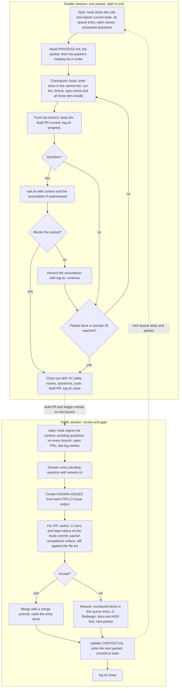
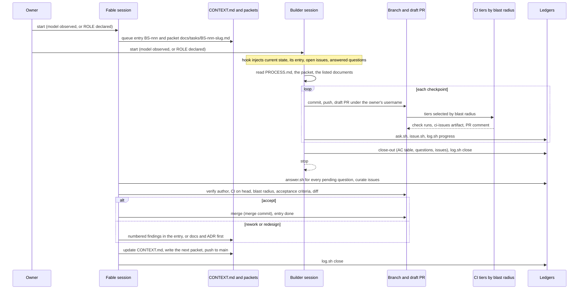
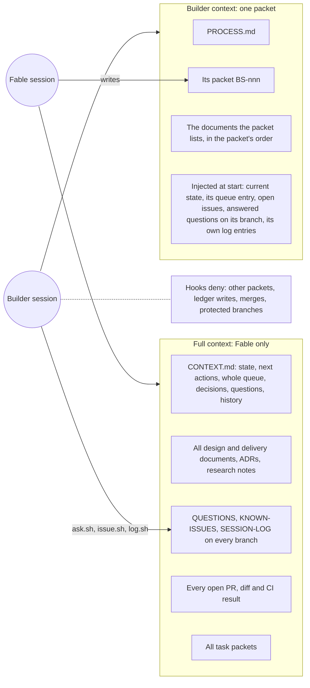
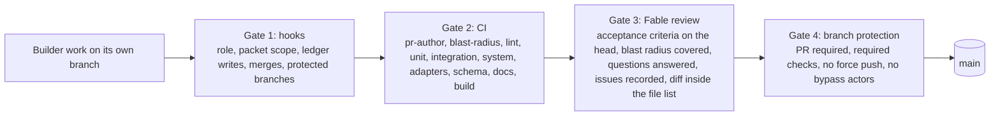

# Session protocol: roles, session lifecycle, context boundary, ledgers, CI and merges

Two kinds of Claude Code sessions work on this repository and gate each other: the **Fable session**
(the most capable model: architect, reviewer, gate, sole writer of `CONTEXT.md`) and **builder
sessions** (other models: one task packet each, on their own branch and PR). The division of labour
is in `docs/PROCESS.md`; this document holds the mechanics the hooks in `.claude/hooks/` enforce
(registered in `.claude/settings.json`, tunable in `.claude/hooks/policy.json`).

**How a session gets its role (ADR-0009).** In order of precedence: `SPENDTRACKER_ROLE` in the
environment (owner override); the model the platform reports at `SessionStart` (`fable|mythos` →
Fable, anything else → builder); otherwise the session is **undeclared** until a prompt states
`ROLE: fable` or `ROLE: builder`. An undeclared session fails closed: it may read and build but may
not merge, push to a protected branch or write a ledger, and it is told to establish its role first
(`get_session` in cloud sessions, else ask the owner). A role from the model or the owner cannot be
changed by a prompt; the first declaration binds for the life of the session; model switches are
blocked. A Fable role that came from a prompt is marked `fable (declared)` in the log.

## Hard rules

1. **Every pull request is opened under the owner's GitHub username** (`pr_author_login` in
   `policy.json`, currently `newellnarco`). Never by a bot, app or other account. The `pre-tool`
   hook checks `gh` identity when it can, and the CI `pr-author` job rejects any other author. A PR
   from another identity is closed, not merged.
2. **Only the Fable session answers questions, curates the ledgers, verifies CI, writes packets and
   merges.** It never writes application code.
3. **Builder sessions build one task packet, on their own branch and draft PR, from their packet
   only, then stop** (ADR-0010). They read `PROCESS.md`, the packet and what it lists; they act on
   the issues, answers and changes Fable put in their queue entry; they ask, report progress and
   record issues through the helper scripts; they never merge or touch `main`.
4. **No session runs past 40 prompts.** Every session ends with a close-out that leaves its
   questions, issues and progress in the repository.
5. **Every known issue is in the ledger before anyone moves on.** A CI failure or an observed
   defect that is not in `KNOWN-ISSUES.md` is a protocol violation for the session that saw it.
6. **CI runs the tiers and the blast radius the change needs, not everything every time.** A full
   run is required only for core, schema or workflow changes, on `main`, or when the Fable session
   asks for one.
7. **A session with no role fails closed.** Undeclared sessions carry every builder restriction
   until their role is established.

## Roles

| | Fable session | Builder session |
| --- | --- | --- |
| Role source | model matches `fable\|mythos`, `SPENDTRACKER_ROLE=fable`, or `ROLE: fable` when no model was reported (then marked *declared*) | any other model, `SPENDTRACKER_ROLE=builder`, or `ROLE: builder` |
| Context | everything: all documents, ledgers, packets, branches, PRs | `PROCESS.md`, its packet, the documents the packet lists, and the start-hook excerpt (current state, its queue entry, open issues, answered questions on its branch, its own log entries) |
| Purpose | read the ledgers, answer questions, curate known issues from CI output, review builder PRs against their packet's acceptance criteria, verify CI tiers and blast radius, merge, write the builder session queue, packets and the rest of `CONTEXT.md`, check in | take its queue entry (the one `in progress` on its branch, else the first `open`), build it end to end to the packet's acceptance criteria, acting on the issues, answers and changes Fable listed, then stop |
| May edit | `docs/`, `.claude/`, `README.md`, `CHANGELOG.md`, `schema/seed/` (`fable_editable_paths`) | the packet's "Files you may touch"; never the ledger files, `CONTEXT.md` or another packet (hook-denied) |
| Ledger writes | answers (`answer.sh`), issue curation, `CONTEXT.md`, log entries | questions (`ask.sh`), issues (`issue.sh`), log entries (`log.sh`) |
| Branch | any; pushes `CONTEXT.md` updates to `main` | the branch the session was started on (cloud sessions: the `claude/<slug>` branch the harness assigns; local sessions: the branch the packet names) |
| Merge / push to main | yes | no |
| Switch model mid-session | no | no |
| Prompt limit | 40 | 40 |
| Ends with | `log.sh close` after `/fable-review` | `/close-out` |

## Session lifecycle, start to end (D-LIFECYCLE)

### What each session must produce

| | Builder session | Fable session |
| --- | --- | --- |
| Starts from | its queue entry and packet, injected and named by the start hook | the whole ledger set, injected by the start hook |
| First action | `log.sh start` naming the entry; read `PROCESS.md`, the packet, its reading list | `log.sh start`; if the role was declared, confirm the model with `get_session` |
| During | one checkpoint at a time, each pushed green; `log.sh progress` per checkpoint; `ask.sh` per question; `issue.sh` per defect or failing check | `answer.sh` per question; `issue.sh` or edits to curate issues; acceptance criteria run on each PR head |
| Ends with | `/close-out`: summary with an AC table (MET / NOT MET / UNVERIFIED with evidence), deviations, assumptions, spend; questions and issues filed; branch pushed; draft PR under the owner's username; `log.sh close` | merges recorded in the log; `CONTEXT.md` updated (state, next actions, queue, decisions, questions, history); the next packet written; `log.sh close` |
| Never | merges, pushes to `main`, edits a ledger or `CONTEXT.md`, reads another packet, starts a second entry, answers a question | writes application code or tests, merges a red, unanswered, unrecorded or wrongly-authored PR, patches `main` forward (revert instead) |

## Interaction (D-SESSION)

## Context boundary (D-CONTEXT)

Only the Fable session holds the full context (ADR-0010). A builder's context is its packet.

| Material | Fable | Builder |
| --- | --- | --- |
| `CONTEXT.md` | all of it, and writes it | current-state table and its own queue entry, injected |
| Task packets | all, and writes them | its own only (other packets are hook-denied) |
| Design and delivery documents | all | the sections its packet lists |
| `QUESTIONS.md` | all branches, answers | questions answered on its branch (injected); appends with `ask.sh` |
| `KNOWN-ISSUES.md` | all, curates | open entries (injected); appends with `issue.sh` |
| `SESSION-LOG.md` | all | its own branch's entries (injected); appends with `log.sh` |
| Other branches and PRs | all | none |
| Research notes, decisions log, owner next actions | all | none |

## Ledger files (all in `docs/00-context/`)

| File | Written by | Entry shape |
| --- | --- | --- |
| `QUESTIONS.md` | builders via `ask.sh`; Fable via `answer.sh` | `Q-YYYYMMDD-xxxx`, Status pending/answered/needs-human, Asked, Question, Context, Answer (Fable), Answered |
| `KNOWN-ISSUES.md` | any session via `issue.sh`; Fable curates status and assignment | `I-YYYYMMDD-xxxx`, Status open/fixed/wontfix, Title, Signature (hash of check+title, used for de-duplication), Check tier, Blast radius paths, Detail, Ref, Recorded, Assigned |
| `SESSION-LOG.md` | any session via `log.sh` | `start / progress / close` with session id, model, role (`fable (declared)` when the role came from a prompt), branch, prompt count; `auto` when written by the SessionEnd hook |
| `CONTEXT.md` | Fable only | current state, owner/Fable next actions, builder session queue (`BS-nnn` entries: packet, slice, branch, goal, read list, scope, exit criteria, issues to fix, answers to act on, changes requested by Fable; status open/in progress/blocked/done), decisions, open questions, phase history |
| `docs/tasks/BS-nnn-<slug>.md` | Fable only | the task packet (PROCESS.md § 3): goal, reading list, acceptance criteria, interfaces, file list, checkpoints, out of scope, tests, constraints, close-log additions, Fable's standing items |

Random id suffixes mean two branches never collide. Entries are append-only; concurrent edits merge
by keeping both sides.

Builder questions and issues are committed on the builder's branch. The Fable start hook fetches
origin and scans every branch's `QUESTIONS.md` for pending entries, so nothing waits on a merge to
be seen. Fable answers on the branch that holds the question (checking it out) or on main with a
note; when the PR merges, the ledgers merge with it.

## CI: tiers, blast radius, issue output

- **Tiers** are separate named checks: `unit`, `integration`, `system` (plus `pr-author`,
  `blast-radius`, `lint`, `adapters`, `schema`, `docs`, `build`). The Fable review requires the
  three tiers present and green on the head commit; branch protection requires eight checks
  (CI-CD.md).
- **Blast radius**: `examples/ci/blast-radius.yaml` maps path globs to the test selectors and tiers
  they affect. The `blast-radius` job diffs the PR against its base, computes the selection, and
  writes a job summary listing tiers run and paths covered. A change touching any
  `ci_full_run_paths` entry (schema, core, workflows, dependency manifests), a push to `main`, the
  label `full-ci`, or `[full-ci]` in a commit message forces the full matrix. Nightly CT always runs
  everything.
- **Issue output**: every failing job converts its JUnit report into `ci-issues.jsonl` (one line
  per failure: check, test id, signature, message, paths) with `examples/ci/ci-issues.py`, uploads
  it as an artifact and posts one PR comment listing signatures. The builder records each new
  signature with `issue.sh`; the Fable review verifies the ledger matches the artifact before
  merging.
- **Known issues at session start**: the start hook injects open entries with their blast radius so
  builders avoid reintroducing them and only fix the ones assigned to their task.

## Gates between a builder's branch and `main` (D-GATES)

## Enforcement map

| Rule | Hook | Mechanism |
| --- | --- | --- |
| Role from the observed model, else declared, else undeclared | `SessionStart` → `session-start.sh`, `UserPromptSubmit` → `prompt-submit.sh` | `SPENDTRACKER_ROLE`, else the `model` field against `fable_model_pattern`, else `undeclared` until the first `ROLE: fable|builder` in a prompt; role and `role_source` stored in `.claude/state/sessions/<id>.json` (gitignored); a prompt never changes an observed role |
| Undeclared sessions fail closed | `PreToolUse` → `pre-tool.sh` | every builder restriction applies while the role is undeclared, so a session that never gets a role can never merge or write a ledger |
| Context per role | `SessionStart` → `session-start.sh` | Fable: role brief, `CONTEXT.md` through the queue, open issues, pending questions on this and other branches, open branches/PRs, last log entries. Builder: brief, current-state table, its own queue entry and packet path, open issues, answered and pending questions on its branch, its own log entries. Undeclared: brief and current state |
| Builder reads only its packet | `PreToolUse` → `pre-tool.sh` | the start hook stores the builder's entry and packet in its state; `Read`/`Edit`/`Write` on any other file under `packet_dir` is denied for non-Fable roles |
| 40-prompt limit | `UserPromptSubmit` → `prompt-submit.sh` | counter per session; warning at 35, forced close-out instruction at 40, prompts blocked (exit 2) at 41+ or after close-out |
| Close-out before ending at the limit | `Stop` → `stop.sh` | blocks the stop (exit 2) with instructions when prompts ≥ 40 and no close entry |
| Unfinished sessions are visible | `SessionEnd` → `session-end.sh` | appends an `auto` close entry when no close-out was logged |
| Only Fable merges or touches main | `PreToolUse` → `pre-tool.sh` | for every non-Fable role: denies `git merge`, `gh pr merge`, pushes to protected branches or force pushes, `git checkout main`, GitHub MCP merge/auto-merge tools, MCP file writes to main |
| Only Fable answers or edits ledgers directly | same | denies Edit/Write to the ledger files and shell writes to them; denies running `answer.sh` |
| Fable does not build | same | denies Edit/Write outside the Fable-editable paths |
| PR author is the owner | same + CI `pr-author` job | `gh api user` check when `gh` exists; reminder on the MCP tool; CI fails any other author |
| Roles cannot be swapped by switching model | `PreModelSwitch` → `pre-model-switch.sh` | blocks the switch |
| Declared roles are visible | `log.sh` | log lines read `fable (declared)` when the role came from a prompt; the Fable review compares the model on the line with the pattern |

`.claude/hooks/selftest.sh` exercises every row above against a scratch copy of the repository and
must pass before a change to the hooks is pushed.

## What the hooks cannot enforce

- Anything done outside Claude Code (the GitHub web UI, a plain terminal). Branch protection on
  `main` is the backstop; the importable rulesets are in `.github/rulesets/`. Enable it.
- **A declared role is self-reported.** When the platform reports no model, a session that states
  `ROLE: fable` gets Fable's rights, including merge. The hooks make that explicit, recorded and
  hard to do by accident; they cannot prove it. Branch protection stops an unwanted merge; the
  session log shows `fable (declared)` so a Fable review can audit it.
- Prompt counting is per session id. `/clear` starts a new id and a new count; a session that
  clears to dodge the limit is visible in the log as an `auto` close entry without a real close-out.
- The builder context boundary is a hard rule only for other packets and the ledgers. Design
  documents live in the same repository and a builder can open them; the brief tells it not to, and
  a PR that strays outside its packet's file list is a Fable review finding.
- Hooks apply to the session that authored them: a session editing `.claude/hooks/` is bound by
  the version already on disk, not the one it is writing.
- The Fable "no building" rule is a path allowlist over Edit/Write; it does not stop shell commands
  that write code. It is a guardrail, not a sandbox.
- The `pre-tool` PR-author check needs `gh`; the MCP path is enforced by CI only.
- CI verification depends on CI existing. Until slice S0 lands `ci.yml`, PRs are not mergeable
  unless the owner overrides, and the override is logged.

## Operating notes

- The hooks need `jq`, `git` and `python3` (for `answer.sh`). `gh` is optional.
- All state lives in `.claude/state/` and is gitignored.
- Change limits, protected branches, editable paths, the PR author, the packet directory and
  full-run paths in `.claude/hooks/policy.json`.
- The skills `/close-out` and `/fable-review` in `.claude/skills/` are the two role checklists.
- Run `.claude/hooks/selftest.sh` after any hook change.
