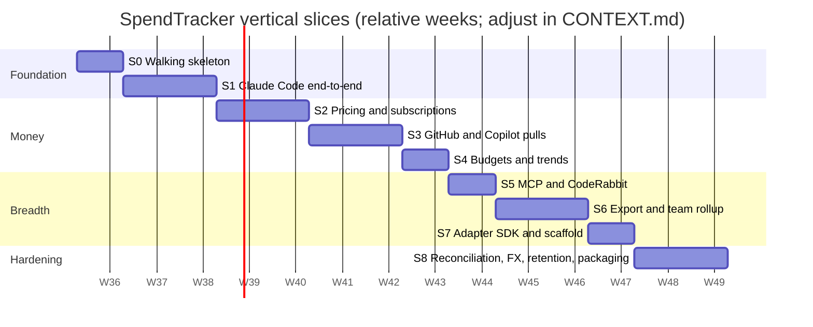

# Vertical slices: the iterative build order

Each slice cuts through collection, storage, pricing, UI, tests and CI to deliver something a user
can see. Every slice ends with the context ledger updated (PHASE-PLAYBOOK.md). Slices are ordered
so that each one is usable on its own and the riskiest assumptions (hooks work, allocation math is
right, rollup is idempotent) are tested early.

## Timeline (D-SLICES)

## Slice template

Every slice below is described with the same headings so a phase can be run from this file alone:
**Goal · Capabilities · Schema · Collectors · Pricing · UI · Tests · CI/CT · Context updates ·
Exit criteria · Demo script**.

---

## S0 — Walking skeleton

- **Goal**: prove the spine. One manual event goes in, is priced, and shows on a page.
- **Capabilities**: C-01, C-02 (stdin only), C-04, C-05 (list only), C-10 (Overview with a single total), C-29 (`st doctor` minimal), C-30 (installable wheel).
- **Schema**: apply `001_core.sql`; seed `app`, `measure` from a static YAML.
- **Collectors**: none; `st add` and `st ingest < envelope.json`.
- **Pricing**: list cost from a hand-entered rate card.
- **UI**: `st serve` renders Overview with "effective this month" (equals list) and a one-series chart.
- **Tests**: migration test; ingest validator; rate lookup; one Playwright smoke.
- **CI/CT**: `ci.yml` with ruff, mypy, pytest on Linux and macOS. No CT yet.
- **Context updates**: CONTEXT.md current state → S0 done; record any deviation from the DDL as ADR-0007.
- **Exit criteria**: `pipx install` from a wheel built in CI; `st add --app claude_api --measure token.output --qty 1000 --model claude-opus-5` then `st report` prints `$0.025`.
- **Demo**: 5 commands in the README.

## S1 — Claude Code end-to-end

- **Goal**: a real session shows up with tokens, model, project, MCP calls and reported cost within seconds.
- **Capabilities**: C-03, C-13, C-14, C-15, C-11 (Sessions page only), C-22 (`st collect` for transcript parser).
- **Schema**: none new; verify `session`/`project` resolution paths.
- **Collectors**: hooks (SessionStart, PostToolUse `mcp__.*`, Stop, SessionEnd), OTLP receiver, transcript parser with backfill.
- **Pricing**: reported cost lines from `cost.reported.usd`; list from rate card for transcript-only sessions.
- **UI**: Sessions list and detail; Overview shows daily tokens by type.
- **Tests**: fixture replay for each hook event and OTLP record; double-count guard (OTLP + transcript same request → one set of events); hook latency test.
- **CI/CT**: add fixture replay job; CT nightly starts: replay all fixtures against the current build and diff expected events.
- **Context updates**: research note `S1-claude-code-signals.md` (what each signal carries, verified date); CONTEXT current state.
- **Exit criteria**: after a 10-minute Claude Code session, Sessions page shows the session with tokens matching `/cost` within 2 %, and MCP calls per server.
- **Demo**: install hooks, run a session, open the page.

## S2 — Pricing and subscriptions

- **Goal**: list vs effective is correct under a Claude Max subscription; savings are visible.
- **Capabilities**: C-06, C-07, C-12 (Subscriptions & rates page), C-05 (`st rates check/sync`).
- **Schema**: none new (all in 001). Possibly 002 if `weights` needs a table; decide via ADR.
- **Pricing**: `usage_share`, `even_daily`, `idle` lines, `st reprice`.
- **UI**: By app page with effective vs list, savings, utilization ratio; subscription editor.
- **Tests**: golden test for COST-MODEL §4; conservation property (Σ allocated + idle = fee for every period, random event sets); re-price idempotency.
- **CI/CT**: property tests in CI; CT adds "rate card age" check that fails when a card is > 180 days old without a successor (warning only).
- **Context updates**: ADR if allocation semantics change; CONTEXT decision log.
- **Exit criteria**: month with mixed usage shows effective = subscription fee to the cent; toggling the subscription off makes effective = list.

## S3 — GitHub and Copilot pulls

- **Goal**: minutes, storage, seats and Copilot credits flow in on a schedule with reported cost.
- **Capabilities**: C-17, C-18, C-22 (scheduler install), C-12 (Collectors page).
- **Schema**: none; new measures registered by manifests.
- **Collectors**: GitHub billing usage (user and org), Copilot ai_credit and premium_request, Copilot metrics reports (org, optional).
- **Pricing**: reported netAmount as `reported`; rate cards for list (Actions per-OS rates, Copilot per-model token rates or credit rate); Copilot subscription with credit allowance and overage.
- **UI**: By app cards for GitHub and Copilot with native units; Collectors page.
- **Tests**: recorded HTTP fixtures; trailing-3-day refetch dedupe; cursor resume; rate-limit backoff.
- **CI/CT**: CT nightly runs adapters against fixtures **and**, on a self-hosted or personal runner with a token, against the live API in read-only mode, asserting schema stability of responses (alerts on vendor changes).
- **Context updates**: research note `S3-github-billing-endpoints.md` with the endpoint list and scopes verified; Q-2 answered.
- **Exit criteria**: scheduled run every hour for 3 days with zero failed `collector_run`; GitHub page totals match the GitHub billing page for the month.

## S4 — Budgets and trends

- **Goal**: "am I on track" for every scope, with forecast and alerts.
- **Capabilities**: C-08, C-11 (Trends, By type, Projects), C-12 (Budgets page).
- **Pricing**: budget consumption over effective + idle.
- **UI**: Budgets page with bars and forecast; Trends with period comparison; By type treemap.
- **Tests**: threshold fires once per period; forecast math; view performance on a 4M-event synthetic DB.
- **CI/CT**: performance benchmark job (warn > targets in WEB-UI §6).
- **Context updates**: CONTEXT; note any UI performance decisions.
- **Exit criteria**: a budget at 80 % triggers a desktop notification and a `SessionStart` context line in Claude Code.

## S5 — MCP and CodeRabbit

- **Goal**: actions and reviews are first-class layers.
- **Capabilities**: C-20, C-19, C-21 (`manual`, `csv_import`).
- **Collectors**: MCP via hooks and `st mcp-proxy`; CodeRabbit via GitHub reviews.
- **Pricing**: CodeRabbit seat subscription with review cap; optional per-call rate cards for paid MCP services.
- **UI**: By app cards; By type shows actions vs reviews vs tokens.
- **Tests**: proxy passthrough equality; CodeRabbit pagination; csv mapping.
- **CI/CT**: fixtures added to nightly replay.
- **Context updates**: Q-3 answered or deferred with reason.
- **Exit criteria**: a PR reviewed by CodeRabbit appears under the project with review count; MCP calls per server per day chart.

## S6 — Export and team rollup

- **Goal**: two nodes roll up into one team dashboard through a git repo.
- **Capabilities**: C-23, C-24, C-25.
- **Schema**: `export-v1.schema.json`; rollup DB uses the same migrations.
- **Collectors**: none new.
- **Pricing**: team YAML rate cards, subscriptions (coverage by user), budgets; re-price on build.
- **UI**: static site build; By user and Subscription utilization views (rollup only).
- **Tests**: rebuild twice → identical DB hash; conservation across nodes; redaction snapshots; schema validation rejects a hand-corrupted line.
- **CI/CT**: rollup repo `rollup.yml` (validate on PR, build + publish on merge); CT: weekly full rebuild from scratch and compare to incremental.
- **Context updates**: Q-1 decided; AGGREGATION.md updated with the chosen contribution model.
- **Exit criteria**: two people export September, CI publishes a dashboard showing both, totals match the sum of their local Overview pages.

## S7 — Adapter SDK and scaffold

- **Goal**: a new layer in under an hour by someone who has not read the core.
- **Capabilities**: C-26.
- **Deliverables**: `core.api` frozen at v1, manifest schema, conformance suite, `st adapter new/test`, template with README checklist.
- **Tests**: all built-in adapters pass the suite; the template passes out of the box.
- **CI/CT**: suite runs per adapter directory; a matrix job installs a third-party adapter from a git URL.
- **Context updates**: ADAPTER-SPEC.md marked v1 stable; CONTEXT records the API freeze.
- **Exit criteria**: a timed exercise: build an adapter for a simple CSV usage export (e.g. an OpenAI usage CSV) from the scaffold in under 60 minutes, with fixtures, passing CI.

## S8 — Reconciliation, FX, retention, packaging

- **Goal**: trustworthy month-end numbers and painless upgrades.
- **Capabilities**: C-27, C-09, C-28, C-30 (release workflow, `st upgrade`), C-29 (full `st doctor`).
- **Tests**: reconciliation cause detection; FX latest-rate selection; compaction preserves totals; upgrade path from S0 schema.
- **CI/CT**: release on tag; CT runs `st migrate` from every historical schema snapshot; install smoke on three OSes.
- **Context updates**: retention policy recorded; Q-4 decided.
- **Exit criteria**: an invoice entered for August reconciles within tolerance or the page names the cause; `pipx upgrade` from S0 build to S8 build migrates a populated DB without loss.

---

## After S8

Candidate slices, to be re-planned with fresh research notes: hosted hub with HTTP import; VS Code
extension for local Copilot signals; Anthropic Admin API adapter promotion (C-16 is small and can
slot into S3 if an org key exists); per-team chargeback reports (`weights`); cost anomaly detection
on daily series.
